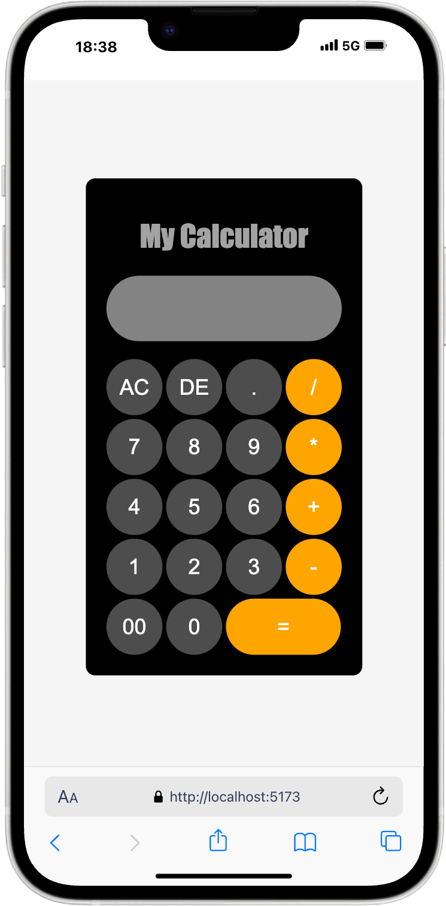

# 🧮 React Calculator App

A simple and responsive calculator built with **React**. This app allows users to perform basic arithmetic operations like addition, subtraction, multiplication, and division.

---

  
📷 Example UI of the Calculator App
